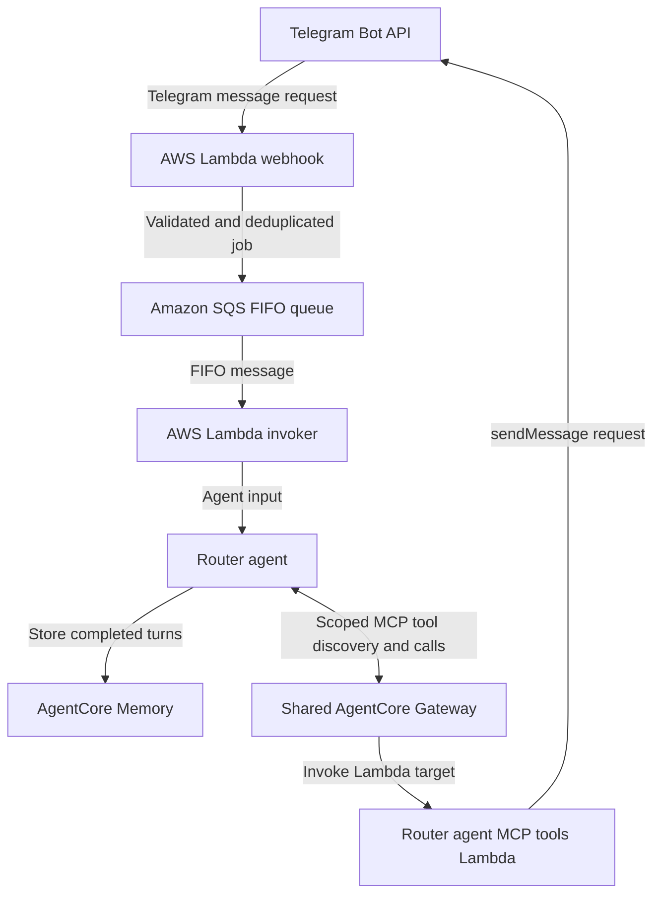

# TZS Personal Assistant Telegram Bot

A private, single-user Telegram assistant built with AWS Bedrock AgentCore,
Strands Agents, Lambda, and Terraform.

The project currently supports an end-to-end text conversation flow: Telegram
delivers a webhook update to Lambda, Lambda validates and enqueues the request
in an SQS FIFO queue, and an invoker Lambda calls an AgentCore runtime. A
Strands agent generates the reply with access to recent conversation history
and sender-scoped long-term memory, then sends it to Telegram through a scoped
MCP tool exposed by a shared AgentCore Gateway.

> This is an active learning project, not a production-ready bot. See
> [Current constraints](#current-constraints) for the main limitations.

## Current capabilities

- Accepts new text messages from one configured Telegram user (myself lol).
- Runs the assistant as a containerized Bedrock AgentCore runtime.
- Uses a configurable Amazon Bedrock model through Strands Agents.
- Loads short-term memory (in the form of recent conversation turns) as context
  for each user request for best-effort statefulness.
- Stores each successful conversation turn in AgentCore Memory.
- Lets the agent semantically retrieve personal facts and preferences from
  sender-scoped long-term memory.
- Connects the router agent to a shared AgentCore Gateway using an IAM-signed
  MCP client and exposes only tools belonging to its router-tools target.
- Sends generated responses to the current Telegram chat through the router
  agent's `send_telegram_message` MCP tool.
- Builds and publishes separate `linux/amd64` Lambda and `linux/arm64`
  AgentCore images to Amazon ECR.
- Provisions the development stack and configures the Telegram webhook through
  repository scripts.
- Includes unit tests plus a live integration test against the deployed runtime
  and Telegram delivery tool.

## Architecture



## Design considerations

### Why the current runtime structure is asynchronous

The first version sent validated Telegram updates directly from the webhook
Lambda to the AgentCore runtime. That was simple, but it coupled Telegram's
webhook request to model invocation, memory operations, and response generation.
Due to Telegram's low HTTP request timeout (30s), slow agent processing risked
exceeding the timeout and causing Telegram to retry the same message request before
an agent response could be successfully generated.

The current structure separates request receipt from request processing. The
webhook Lambda authenticates and validates the telegram message request, places
a job on SQS, and returns quickly. The invoker Lambda consumes the FIFO message,
invokes the router agent, and consumes its completion response. The router agent
sends its generated response through an MCP tool exposed by the shared AgentCore
Gateway. This provides a foundation for longer-running tasks and future specialized
agents without making the webhook or invoker responsible for message delivery.

- Webhook Lambda remains lightweight and focused on authentication,
  validation, and queueing.
- SQS provides a durable handoff and preserves ordering for the single-user
  conversation, with initial duplicate suppression through FIFO deduplication.
- The shared Gateway provides a reusable path to agent tools, while source-level
  filtering limits the router agent to tools registered under its own target.

## Repository layout

```text
.
├─ infra/
|   ├─ environments/
|   |   ├─ bootstrap/   # Versioned S3 Terraform state bucket
|   |   └─ dev/         # Complete development stack
|   └─ modules/         # Reusable ECR, IAM, Lambda, and AgentCore modules
├─ scripts/
|   ├─ configure_telegram_webhook.py
|   ├─ run_bootstrap.sh
|   └─ run_build_dev.sh
├─ src/
|   ├─ agentcore/
|   |   └─ router_agent/            # Router (orchestrator) agent runtime code
|   ├─ lambdas
|   |   ├─ invoker/                 # SQS-to-AgentCore invoker
|   |   ├─ mcp_tools/               # MCP tools for agents
|   |   |   └─router_agent_tools/
|   |   └─ webhook/                 # Telegram webhook Lambda
|   └─ shared/      # Shared schemas and memory service
├─ tests/           # Unit and live integration tests
└─ pyproject.toml   # Development and test dependencies
```

## Prerequisites

- Python 3.11 or newer.
- Terraform 1.5 or newer.
- Docker with Buildx and support for `linux/amd64` and `linux/arm64` builds.
- AWS credentials available through a named profile.
- AWS permissions to manage S3, IAM, ECR, Lambda, Bedrock AgentCore runtime,
  Gateway, Gateway targets, and AgentCore Memory resources, plus permission to
  invoke the selected Bedrock model.
- A Telegram bot token and the numeric Telegram user ID allowed to use the bot.

The development configuration currently assumes the AgentCore resources are in
`us-east-1`. Use that value for `AWS_REGION` unless the Terraform region wiring
is updated as well.

## Configuration

Create a `.env` file at the repository root with these values:

```dotenv
AWS_PROFILE=your-aws-profile
AWS_REGION=us-east-1
BACKEND_S3_BUCKET_NAME=your-globally-unique-terraform-state-bucket
TELE_PID=your-numeric-telegram-user-id
TELE_BOT_API_KEY=your-telegram-bot-token
AGENT_RUNTIME_MODEL_ID=your-bedrock-model-or-inference-profile-id
```

`TELE_PID` is the only sender and chat ID accepted by the webhook handler.

## Provisioning

Run all commands from the repository root.

### 1. Bootstrap Terraform state

```bash
sh scripts/run_bootstrap.sh
```

This creates the versioned S3 bucket used by the development environment's
Terraform backend. It is normally a one-time operation for an AWS account and
environment.

### 2. Build and deploy the development stack

```bash
sh scripts/run_build_dev.sh
```

The development script:

1. Loads and validates the required `.env` values.
2. Creates `.venv` when needed and installs the `dev` dependency group.
3. Checks formatting for all infra(`. tf`) files.
4. Initializes the S3-backed Terraform environment.
5. Builds container architectures and pushes content-tagged images to ECR.
6. Plans and automatically applies the development infrastructure.
7. Registers the deployed Lambda Function URL as the Telegram webhook.
8. Runs the full pytest suite.

The live integration test invokes the deployed router and sends its acknowledgement
to the configured `TELE_PID` through the Telegram MCP tool.

The script uses `terraform apply -auto-approve`; inspect infrastructure changes
before running it when the Terraform configuration has changed substantially.

### Destroy resources

Destroy the development stack before removing its backend:

```bash
bash scripts/run_build_dev.sh --destroy true
bash scripts/run_bootstrap.sh --destroy true
```

The development destroy path also removes the Telegram webhook. ECR repositories
and the bootstrap state bucket are configured for forced deletion, so treat these
commands as destructive.

## Current constraints

- Only new text messages are handled; edited messages and non-text updates are
  ignored or rejected.
- The bot is intentionally single-user (I designed it with my personal use in mind).
- The router currently has long-term memory retrieval and Telegram message
  delivery tools; additional specialized tools and other sub-agents are not implemented yet.
- Dependency versions are currently unpinned, and checks run locally rather than
  in a CI pipeline.

## Next steps

1. Add response chunking to work around Telegram's message length limit.
2. Add HTML response parse mode with safe formatting and escaping.
3. Add durable request idempotency using a DynamoDB-backed update ledger.
4. Create a read-only coding agent, invoked by the router agent, with access to
   GitHub through external tooling.
