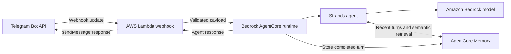

# TZS Personal Assistant Telegram Bot

A private, single-user Telegram assistant built with AWS Bedrock AgentCore,
Strands Agents, Lambda, and Terraform.

The project currently supports an end-to-end text conversation flow: Telegram
delivers a webhook update to Lambda, Lambda validates the sender and invokes an
AgentCore runtime, and a Strands agent generates the reply with access to recent
conversation history and sender-scoped long-term memory.

> This is an active learning project, not a production-ready bot. See
> [Current constraints](#current-constraints) for the main limitations.

## Current capabilities

- Accepts new text messages from one configured Telegram user (myself lol).
- Rejects malformed payloads, edited messages, and messages from other users.
- Runs the assistant as a containerized Bedrock AgentCore runtime.
- Uses a configurable Amazon Bedrock model through Strands Agents.
- Loads short-term memory (in the form of recent conversation turns) as context
  for each user request for best-effort statefulness.
- Stores each successful conversation turn in AgentCore Memory.
- Lets the agent semantically retrieve personal facts and preferences from
  sender-scoped long-term memory.
- Builds and publishes separate `linux/amd64` Lambda and `linux/arm64`
  AgentCore images to Amazon ECR.
- Provisions the development stack and configures the Telegram webhook through
  repository scripts.
- Includes unit tests plus an opt-in live AgentCore integration test.

## Architecture



AgentCore Memory uses a stable session per Telegram sender. Its current memory
configuration has a 7-day event expiry and built-in semantic and user-preference
strategies under sender-specific namespaces.

## Repository layout

```text
.
├─ infra/
|   ├─ environments/
|   |   ├─ bootstrap/       # Versioned S3 Terraform state bucket
|   |   └─ dev/             # Complete development stack
|   └─ modules/             # ECR, image, Lambda, runtime, and memory modules
├─ scripts/
|   ├─ configure_telegram_webhook.py
|   ├─ run_bootstrap.sh
|   └─ run_build_dev.sh
├─ src/
|   ├─ agentcore/router_agent/  # Strands agent and AgentCore container
|   ├─ lambdas/webhook/         # Telegram webhook Lambda container
|   └─ shared/                  # Shared schemas and memory service
├─ tests/                       # Unit and live integration tests
└─ pyproject.toml               # Local development and test dependencies
```

## Prerequisites

- Python 3.11 or newer.
- Terraform 1.5 or newer.
- Docker with Buildx and support for `linux/amd64` and `linux/arm64` builds.
- AWS credentials available through a named profile.
- AWS permissions to manage S3, IAM, ECR, Lambda, Bedrock AgentCore runtime,
  and AgentCore Memory resources, plus permission to invoke the selected
  Bedrock model.
- A Telegram bot token and the numeric Telegram user ID allowed to use the bot.

The development configuration currently assumes the AgentCore runtime is in
`us-east-1`. Use that value for `AWS_REGION` unless the Terraform region wiring
is updated as well.

## Configuration

Create a `.env` file at the repository root with these values:

```dotenv
AWS_PROFILE=your-aws-profile
AWS_REGION=us-east-1
BACKEND_S3_BUCKET_NAME=your-globally-unique-terraform-state-bucket
TELE_PID=your-numeric-telegram-user-id
TELE_BOT_API_KEY=your-telegram-bot-token
AGENT_RUNTIME_MODEL_ID=your-bedrock-model-or-inference-profile-id
```

`TELE_PID` is the only sender and chat ID accepted by the webhook handler.

## Provisioning

Run all commands from the repository root.

### 1. Bootstrap Terraform state

```bash
sh scripts/run_bootstrap.sh
```

This creates the versioned S3 bucket used by the development environment's
Terraform backend. It is normally a one-time operation for an AWS account and
environment.

### 2. Build and deploy the development stack

```bash
sh scripts/run_build_dev.sh
```

The development script:

1. Loads and validates the required `.env` values.
2. Creates `.venv` when needed and installs the `dev` dependency group.
3. Checks formatting for all infra(`. tf`) files.
4. Initializes the S3-backed Terraform environment.
5. Builds container architectures and pushes content-tagged images to ECR.
6. Plans and automatically applies the development infrastructure.
7. Registers the deployed Lambda Function URL as the Telegram webhook.
8. Runs the full pytest suite.

The script uses `terraform apply -auto-approve`; inspect infrastructure changes
before running it when the Terraform configuration has changed substantially.

### Destroy resources

Destroy the development stack before removing its backend:

```bash
bash scripts/run_build_dev.sh --destroy true
bash scripts/run_bootstrap.sh --destroy true
```

The development destroy path also removes the Telegram webhook. ECR repositories
and the bootstrap state bucket are configured for forced deletion, so treat these
commands as destructive.

## Current constraints

- Only new text messages are handled; edited messages and non-text updates are
  ignored or rejected.
- The bot is intentionally single-user and has no group-chat workflow.
- The agent's only custom tool is long-term memory retrieval. It does not yet
  call calendars, email, web search, or other external action services.
- The Lambda Function URL uses `authorization_type = "NONE"`. Sender checks are
  performed against fields in the request body, but the webhook does not yet
  authenticate requests with a Telegram secret token or another trusted edge
  control.
- Dependency versions are currently unpinned, and checks run locally rather than
  in a CI pipeline.

## Next steps
1. More robust inbound auth to webhook lambda using a secret token comprising a hashed
  value of my telegram bot api key.
2. Create a read-only coding agent (invoked by my current router agent) with access
  to my github thru external tooling.
3. Idk and more...
  